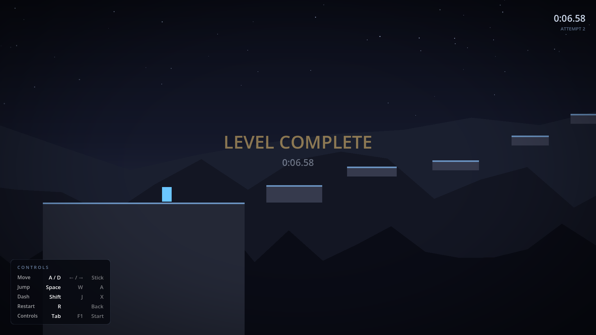

# Project Ascent

Project Ascent is a compact 2D precision platformer built around responsive
movement, fast retries, readable traversal, and a quiet atmospheric presentation.

## Current status

**v0.1.0 — First Playable**

This release is a deliberately small, frozen demo: one authored greybox route,
one goal, and a complete movement kit. It is an offline-first project with no
accounts, backend, ads, or network runtime.

The route and controller passed the release validation described in
[`docs/FINAL_DEMO_REPORT.md`](docs/FINAL_DEMO_REPORT.md). The project is not a
finished commercial game and does not include final production art, audio, or a
larger content pipeline.

## Features

- Responsive running with acceleration, deceleration, and air control
- Jumping with derived physics, coyote time, jump buffering, and variable height
- Wall slide and wall jump with launch lockout
- One air dash per flight, landing refresh, momentum handling, and landing-input buffer
- Fast fall respawn, manual restart, attempt counter, and run timer
- Goal completion feedback that preserves the finishing time
- Procedural stars, parallax ridges, readable platform edges, player feedback, and dash afterimages
- Keyboard and controller bindings generated from Godot's live `InputMap`
- Single-threaded HTML5 export using the Compatibility renderer

## Gameplay

The route is a short left-to-right climb:

`Ground → P1 → P2 → P3 → P4 → LaunchPad → DashPad → TopLedge`

The opening jump teaches the basic movement, the rising platforms build toward
advanced movement, and the LaunchPad-to-DashPad transition is the route's large
dash gate. Touching the amber goal records the run, shows the completion banner,
and immediately starts the next attempt at spawn.

## Controls

| Action | Keyboard | Controller |
| --- | --- | --- |
| Move left/right | A/D or Left/Right | Left stick X |
| Jump | Space or W | A / south button |
| Dash | Shift or J | X / west button |
| Restart | R | Back / Select |
| Show/hide controls | Tab or F1 | Start |

The controls panel is visible on launch and can be restored with Tab, F1, or
Start after it fades.

## Screenshots




These images are rendered gameplay captures from the release validation pass;
they are not editor or debug screenshots.

## Run locally

### Requirements

- Godot **4.7.2 stable**
- Git
- Python 3, only for the local web preview
- PowerShell, only for the all-suite test wrapper

Clone the repository, open it in Godot, and run the project (F6/F5 in the
editor, or the equivalent command-line invocation):

```text
git clone <repository-url>
cd project-ascent
godot --editor --path .
godot --path .
```

On Windows, replace `godot` with the path to your Godot 4.7.2 executable. The
project opens at `scenes/main_scene.tscn`; no external service or account is
required.

## HTML5 / Web build

Install the matching Godot 4.7.2 export templates, then export the configured
`Web` preset:

```text
godot --headless --path . --export-debug "Web" build/web/index.html
python tools/serve_web.py 8060
```

Open <http://127.0.0.1:8060/> after the server starts. The local server supplies
the WASM MIME type and the headers used by the project workflow. The preset is
single-threaded and excludes development-only addon, test, tool, and document
content from the shipped payload.

## Development and testing

The canonical local validation command is:

```text
pwsh -File tools/run_all_tests.ps1 -GodotPath "C:\path\to\Godot_v4.7.2-stable_console.exe"
```

If Godot is already on `PATH`, `-GodotPath` can be omitted. The wrapper runs the
five project suites and currently passes **84 assertions with 0 failures**.
The individual suites are in `tests/` and the rendered/performance probes are
in `tools/`.

Useful checks:

```text
godot --headless --path . --quit-after 120
godot --headless --path . --script res://tests/test_level.gd
godot --path . --script res://tools/capture_run.gd
godot --path . --script res://tools/probe_perf.gd
```

See [`docs/ARCHITECTURE.md`](docs/ARCHITECTURE.md) for the full validation
matrix and [`docs/SESSION_HANDOFF.md`](docs/SESSION_HANDOFF.md) for safe
continuation instructions.

## Architecture

Runtime responsibilities are intentionally small:

- `scripts/player.gd` — movement state and physics
- `scripts/main_scene.gd` — spawn, timer, attempts, respawn, and completion loop
- `scripts/platform.gd` — reusable platform geometry and collider synchronization
- `scripts/player_visuals.gd` — non-authoritative player feedback and pooled ghosts
- `scripts/hud.gd` — live InputMap controls, timer, attempts, and completion UI
- `scripts/star_field.gd` / `scripts/parallax_ridge.gd` — procedural backdrop

The reusable Godot MCP toolkit under `addons/godot_mcp_toolkit/` is development
tooling only and is excluded from the Web export. Its per-user `.mcp.json`
configuration is intentionally not tracked; use the shipped template only when
you explicitly need the local bridge.

## Project structure

```text
scenes/       Godot scenes for the level, player, platforms, backdrop, and HUD
scripts/      Runtime GDScript
tests/        Headless behavior and presentation regression suites
tools/        Test wrapper, web server, probes, and capture scripts
shaders/      Small presentation shader(s)
addons/       Development-only Godot MCP toolkit and its attribution/license
docs/         Architecture, handoff, audit, tools, and release documentation
```

## Release validation

The v0.1.0 checkpoint was audited with Godot 4.7.2:

- 84 automated assertions passed across five suites
- headless boot passed
- native route completed in 395 physics frames
- rendered capture produced 39 gameplay frames, including completion
- fresh HTML5 export succeeded and loaded in the local browser preview
- native performance probe held 108 nodes throughout the route
- native wall-frame average was 16.668 ms in the managed test environment

The browser preview was verified for load, rendering, HUD presence, and a clean
console. Deterministic full-route completion was verified in the native rendered
playthrough because the browser automation harness did not reliably inject
movement keys.

## Known limitations

- One compact greybox route and one goal
- No authored audio or final production-art pipeline
- Wall jump is implemented and tested but is optional on the current route
- No saves, settings, inventory, accounts, multiplayer, or online services
- Browser frame timing was not measured in the final audit

## Roadmap

There is no active feature roadmap beyond this frozen First Playable. If the
project is reopened, the next decision should be human-led authored art/audio
or a deliberately designed wall-jump section. New mechanics and systems should
not be added by default.

## Contributing

This is a small portfolio/demo repository with a deliberately narrow scope.
Before proposing a change, read the handoff and architecture documents, keep
the movement and presentation decisions intact, and run the complete test
wrapper. Gameplay or dependency changes should include evidence from a native
playtest and updated documentation.

## License

No root project license has been selected yet. Project Ascent's source, original
game content, and branding are therefore not granted reuse rights by this
repository. Please do not redistribute or adapt them until the owner publishes
an explicit license.

The bundled `addons/godot_mcp_toolkit/` is a separate development addon with its
own MIT `LICENSE` and `ATTRIBUTIONS.md`; that license does not license the game.
Godot and the Godot logo are trademarks of the Godot Foundation.

## Further reading

- [`docs/RELEASE_NOTES_v0.1.0.md`](docs/RELEASE_NOTES_v0.1.0.md) — release notes
- [`docs/ARCHITECTURE.md`](docs/ARCHITECTURE.md) — technical reference
- [`docs/SESSION_HANDOFF.md`](docs/SESSION_HANDOFF.md) — authoritative continuation guide
- [`docs/FINAL_DEMO_REPORT.md`](docs/FINAL_DEMO_REPORT.md) — S2–S7 audit record
- [`docs/TOOLS.md`](docs/TOOLS.md) — evaluated development tools and dependencies
