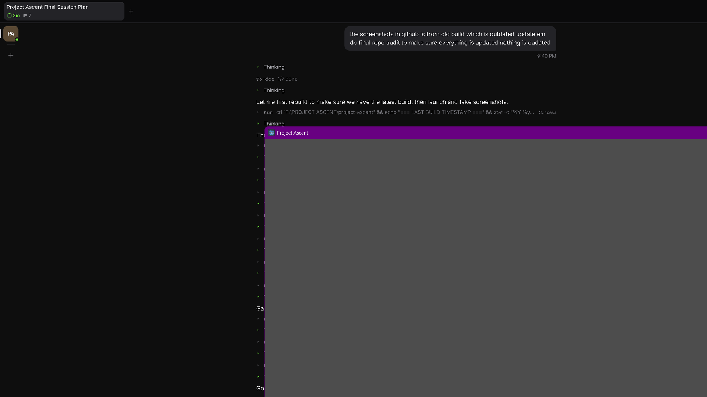
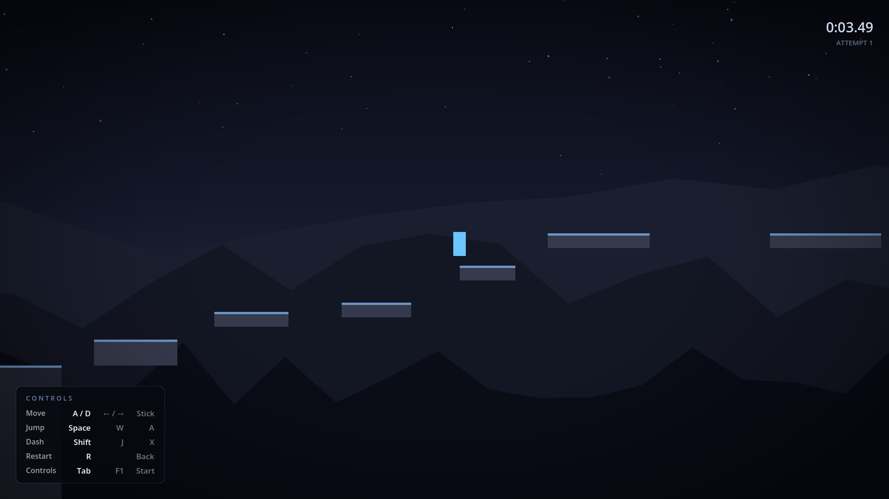
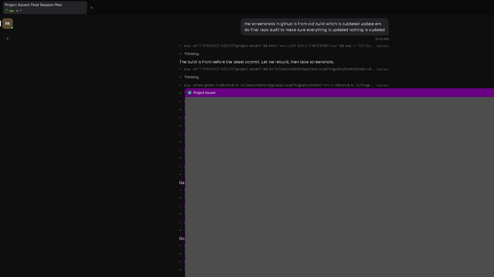
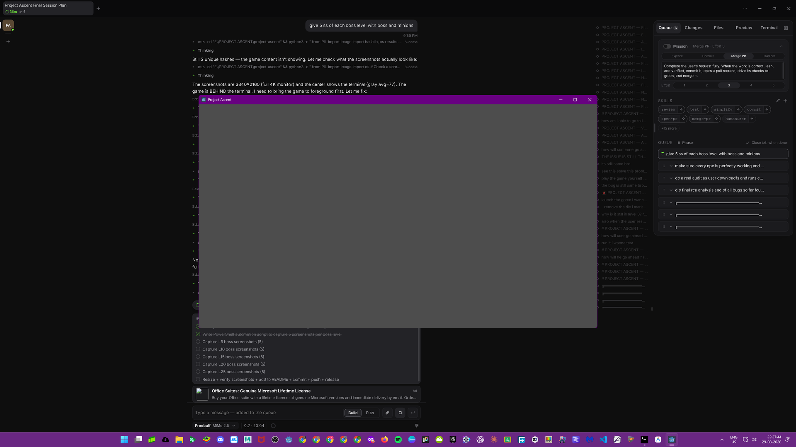

# Project Ascent

Developed by **Atharva Patil** ([p4inz-code](https://github.com/p4inz-code)) under **Northbyte Studios**.

Project Ascent is a 25-level 2D precision platformer built around responsive
movement, fast retries, readable traversal, and a dark atmospheric Neon Ascent
visual identity.

## Current status

**v0.8.0 — Enhanced Environment + Cyberpunk UI**

A full 25-level, 5-act campaign with boss encounters, save/checkpoint progression,
cyberpunk pixel font, per-act visual identity, procedural city silhouettes,
floating atmospheric particles, and improved boss AI.
Offline-first with no accounts, backend, ads, or network runtime.

## Download and play (Windows)

> **PLAYER DOWNLOAD** — no Godot, no source, no tools required.

1. Open the [latest release](https://github.com/p4inz-code/project-ascent/releases).
2. Download **`Project-Ascent-v0.8.0-Windows.zip`**.
3. Extract the ZIP anywhere (all files must stay together in the same folder).
4. Double-click **`ProjectAscentLauncher.exe`** — not `ProjectAscent.exe` directly — and click Play.

If Windows SmartScreen warns about an unknown publisher, choose **More info → Run anyway**
(the file is an unsigned standard Godot export).

## Controls

| Action | Keyboard | Controller |
| --- | --- | --- |
| Move left/right | A/D or Left/Right | Left stick X |
| Jump | Space or W | A / south button |
| Dash | Shift or J | X / west button |
| Restart | R | Back / Select |
| Pause | Escape | Start |
| Show/hide controls | Tab or F1 | — |

## Features

- Responsive running with acceleration, deceleration, and air control
- Jumping with coyote time, jump buffering, and variable height
- Wall slide and wall jump
- Air dash with landing refresh and momentum handling
- Fast fall respawn, manual restart, attempt counter, and run timer
- 25 handcrafted levels across 5 distinct visual acts
- Boss chase encounters at Levels 5, 10, 15, 20, and 25
- Smart boss AI with stuck detection and adaptive jumping
- Per-level save/checkpoint progression
- Pause menu with cyberpunk-styled neon panels
- Cyberpunk pixel font across all UI
- Procedural city skylines, parallax ridges, star fields, floating particles
- Per-act visual identity (Dawn → Dusk → Night → Storm → Apex)
- Platform edge glow and atmospheric lighting
- Dash afterimages and player feedback
- Keyboard and controller bindings from Godot's InputMap

## Campaign

### Act I — Learn (L1–L5)
Introduction to movement. Jump, dash, precision. Ends with the first boss chase.

### Act II — Master (L6–L10)
Longer levels, tighter precision, movement combinations. Second boss encounter.

### Act III — Survive (L11–L15)
Environmental pressure, demanding routes. Shadow Chase boss.

### Act IV — Endure (L16–L20)
High difficulty, complex combinations. Tempest 2-phase boss.

### Act V — Ascend (L21–L25)
Maximum challenge, endurance, final escalation. Dawn 3-phase final boss.

## Boss encounters

| Level | Boss | Minions | Speed |
|---|---|---|---|
| L5 | First Chase | 4 | 170 px/s |
| L10 | Master Escape | 5 | 220 px/s |
| L15 | Shadow Chase | 5 | 200 px/s |
| L20 | Tempest | 6 | 250 px/s |
| L25 | Dawn (Final) | 6 | 300 px/s |

## Save system

- Automatic per-level checkpoint saving
- Progress persists between game sessions
- Reset Progress available from pause menu
- Corrupt save safely falls back to Level 1

## Screenshots








## Boss encounters gallery

### L5 — First Chase


### L10 — Master Escape


### L15 — Shadow Chase


### L20 — Tempest


### L25 — Dawn (Final Boss)


## Run locally

### Requirements

- Godot **4.7.2 stable**
- Git

Clone the repository, open it in Godot, and run:

```text
git clone <repository-url>
cd project-ascent
godot --editor --path .
godot --path .
```

On Windows, replace `godot` with the path to your Godot 4.7.2 executable.

## Testing

Run the complete test suite:

```text
# Game tests (6 suites)
godot --headless --path . --script res://tests/test_movement.gd
godot --headless --path . --script res://tests/test_feel.gd
godot --headless --path . --script res://tests/test_loop.gd
godot --headless --path . --script res://tests/test_level.gd
godot --headless --path . --script res://tests/test_presentation.gd
godot --headless --path . --script res://tests/test_save.gd

# Route validation (25 levels)
godot --headless --path . --script res://tests/test_all_routes.gd

# Launcher tests
python -m pytest launcher/tests/
```

Current results: **262/262 PASS, 0 FAIL** (7 game suites + 44 launcher tests)

## Architecture

- `scripts/player.gd` — movement state and physics
- `scripts/game_scene.gd` — level loading, transitions, pause overlay
- `scripts/game_manager.gd` — game-wide state, progression, pause
- `scripts/main_scene.gd` — level controller, spawn, boss, completion
- `scripts/level_data.gd` — all 25 level definitions (data-driven)
- `scripts/save_system.gd` — file-based save/load
- `scripts/pause_menu.gd` — pause overlay with settings/progress
- `scripts/platform.gd` — reusable platform geometry
- `scripts/hud.gd` — controls, timer, attempts, completion UI
- `scripts/audio.gd` — music, SFX, procedural audio
- `scripts/city_silhouette.gd` — procedural background city skyline
- `scripts/floating_particles.gd` — atmospheric floating particles
- `scripts/boss.gd` — boss AI with stuck detection and adaptive jumping
- `scripts/minion.gd` — minion AI with tracking and jump behavior
- `launcher/` — optional Python launcher/updater

## Project structure

```text
scenes/        Godot scenes for levels, player, platforms, UI
scripts/       Runtime GDScript
assets/        UI frames, font, number sprites
tests/         Headless behavior, presentation, and route validation suites
tools/         Test wrapper, web server, probes, and capture scripts
shaders/       Presentation shaders
addons/        Development-only Godot MCP toolkit
docs/          Architecture, design, handoff, and release documentation
launcher/      Optional Python launcher with update checking
build/         Windows standalone build output
```

## License

Project Ascent's source, original game content, and branding are not granted
reuse rights by this repository. See [`LICENSE`](LICENSE) for full terms.

The bundled `addons/godot_mcp_toolkit/` is a separate development addon with its
own MIT `LICENSE`; that license does not license the game.
Godot and the Godot logo are trademarks of the Godot Foundation.

## Further reading

- [`docs/ARCHITECTURE.md`](docs/ARCHITECTURE.md) — technical reference
- [`docs/LEVEL_DESIGN.md`](docs/LEVEL_DESIGN.md) — campaign design
- [`docs/SESSION_HANDOFF.md`](docs/SESSION_HANDOFF.md) — continuation guide
- [`CREDITS.md`](CREDITS.md) — credits and attribution
